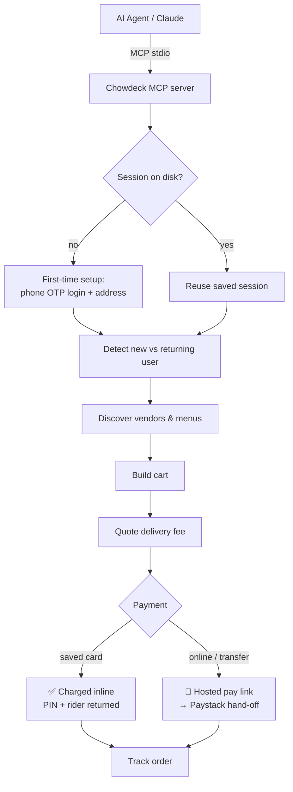

# 🍲 Chowdeck MCP

> A [Model Context Protocol](https://modelcontextprotocol.io) server that lets an
> AI agent order food and groceries on **[Chowdeck](https://chowdeck.com)**
> (Nigeria) — discover vendors, get meal suggestions, build a cart, place an
> order, and track delivery.

[](https://github.com/thathman/chowdeck-mcp/actions/workflows/ci.yml)
[](./LICENSE)
[](https://github.com/sponsors/thathman)

Built and maintained by **[Hendrix Nwaokolo (@thathman)](https://github.com/thathman)**.

---

## ⚠️ Project status

| Capability | Status |
| --- | --- |
| Browse vendors, menus, search, suggestions | ✅ Working |
| Guest & authenticated carts | ✅ Working |
| Phone-OTP login, profile, addresses, wallet | ✅ Working |
| Place & track orders | ✅ Working |
| **Pay — returning customer with a connected (saved) card** | ✅ **Working** (charges inline) |
| **Pay — online payment / bank transfer (card-less & new customers)** | 🚧 **In progress** |

> **Right now, ordering end-to-end only completes for existing customers who have
> a card already connected to their Chowdeck account.** Online payment (bank
> transfer, card-less, and brand-new customers) reaches the Paystack hand-off but
> is not yet fully automated. See the [Changelog](./CHANGELOG.md) for details.

---

## ⚖️ Disclaimer — unofficial & unaffiliated

> **This is an independent, unofficial project. It is not affiliated with,
> endorsed by, or supported by Chowdeck.** It talks to Chowdeck's private
> storefront API the same way the official web app does. As a result:
>
> - **No credentials are bundled.** You authenticate as *yourself* with your own
>   phone + OTP, and supply your own Google Maps key (`CHOWDECK_MAPS_KEY`) for
>   reverse-geocoding. The project ships no API keys or tokens.
> - **Respect Chowdeck's Terms of Service.** Use it for your own account and
>   personal ordering. Don't scrape, resell, automate abusively, or hammer the
>   API — the client is rate-limit-friendly (timeouts, bounded retries) for that
>   reason. You are responsible for your own use.
> - **It may break at any time.** Because the API is private and undocumented,
>   Chowdeck can change it without notice. Endpoints marked *best-effort* in the
>   code are inferred and may need updating.
> - **Trademarks** ("Chowdeck", "Paystack") belong to their owners and are used
>   only to describe interoperability.
>
> If you represent Chowdeck and would like changes, please open an issue.

---

## 🧭 How it works



> 📌 A richer architecture/visualisation diagram will be added here later.

---

## ✨ Features

The server exposes **38 tools**, grouped by capability (request/response details
are intentionally omitted from this README):

- **Setup & session** — persistent login + delivery address, automatic
  new-vs-returning customer detection, saved payment preference.
- **Location** — address autocomplete, place details, reverse geocoding, and
  saving a precisely resolved delivery address (no guessed coordinates).
- **Discovery** — storefront config, vendor listings, featured/handpicked
  vendors, search, menu categories, menus, and individual menu items.
- **Cart** — create/update, list all, per-vendor view, clear, delete.
- **Auth** — Nigerian phone-number OTP login and profile lookup.
- **Account** — saved addresses, wallet balance, order history, payment methods.
- **Orders & checkout** — delivery-fee quote, place order, active orders, order
  detail (with delivery PIN + rider info), payment channels, payment start, and
  payment verification.

Sessions persist to `~/.chowdeck-mcp/session.json`, so the one-time login and
address setup survive restarts.

---

## 🌳 Working tree

```
chowdeck-mcp/
├── mcp/                      # The MCP server
│   ├── src/
│   │   ├── index.ts          # Tool definitions + server wiring (stdio)
│   │   ├── api.ts            # Chowdeck API client
│   │   └── session.ts        # Disk-persisted session store
│   ├── package.json
│   └── tsconfig.json
├── skill/
│   └── chowdeck/
│       └── SKILL.md          # Claude/agent skill: how to drive the server
├── .github/
│   ├── workflows/ci.yml      # Build + smoke-test on push/PR
│   └── FUNDING.yml           # Sponsorship
├── CHANGELOG.md
├── LICENSE                   # MIT
└── README.md
```

---

## 🚀 Getting started

### Prerequisites
- Node.js 20+ and npm
- A Nigerian phone number with a Chowdeck account (for authenticated flows)

### Install & build

```bash
git clone https://github.com/thathman/chowdeck-mcp.git
cd chowdeck-mcp/mcp
npm install
npm run build
```

### Register with an MCP client

> **Note:** An MCP server is not "installed" like an app — it is registered with
> your agent/client as a command the client launches over stdio. You cannot
> simply tell a client to "install this repo"; point it at the built server (or
> at `npx` once published — see below).

**Claude Code / CLI:**

```bash
claude mcp add chowdeck -- node /absolute/path/to/chowdeck-mcp/mcp/dist/index.js
```

**OpenClaw / generic MCP client (`mcpServers` config):**

```json
{
  "mcpServers": {
    "chowdeck": {
      "command": "node",
      "args": ["/absolute/path/to/chowdeck-mcp/mcp/dist/index.js"]
    }
  }
}
```

Add that block to your client's MCP config (for OpenClaw, its MCP servers
settings), then restart the client. The agent will then see the `chowdeck` tools.

### One-line install via npx (after publishing to npm)

Once this package is published to npm (`npm publish` from `mcp/`), no clone or
build is needed — clients can launch it directly:

```json
{
  "mcpServers": {
    "chowdeck": {
      "command": "npx",
      "args": ["-y", "chowdeck-mcp"]
    }
  }
}
```

Until then, use the build-from-source steps above.

### As an agent skill
The bundled [`skill/chowdeck/SKILL.md`](./skill/chowdeck/SKILL.md) tells the agent
how to run first-time setup, branch on new-vs-returning customers, resolve an
exact delivery address, and always confirm the order (and announce the delivery
PIN + rider) before checkout.

---

## 🔐 Privacy & security

- Your auth token, guest id, address id, phone, and payment preference live only
  in `~/.chowdeck-mcp/session.json` on your machine. Nothing is sent anywhere
  except Chowdeck's own API.
- OTP codes and tokens are treated as secrets and are never echoed back in
  summaries.
- Run `logout` (a tool) to wipe the saved session.

---

## 📒 Changelog

See **[CHANGELOG.md](./CHANGELOG.md)** for version history and the current state
of the online-payment work.

---

## 💜 Sponsor

If this saves you time, consider [sponsoring the project](https://github.com/sponsors/thathman).

---

## 📄 License & attribution

Licensed under the **[MIT License](./LICENSE)** — free to use, copy, modify, and
distribute (including commercially); just keep the copyright and license notice.

Built and maintained by **[Hendrix Nwaokolo (@thathman)](https://github.com/thathman)**
/ [Airix Media](https://airixmedia.com). A credit or ⭐ is always appreciated.

